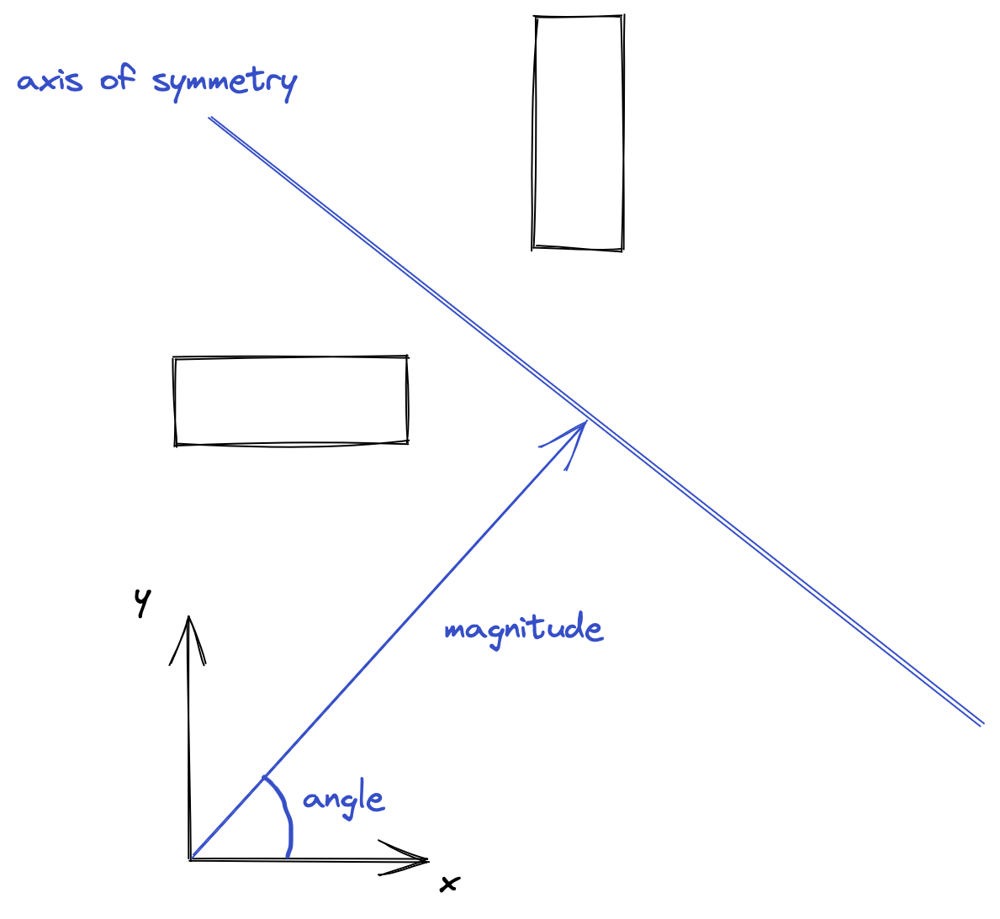
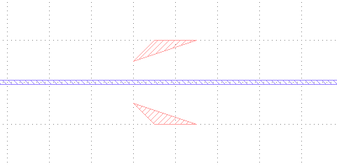
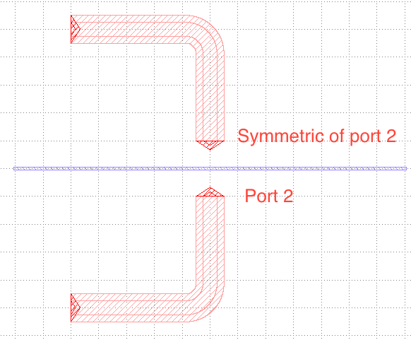
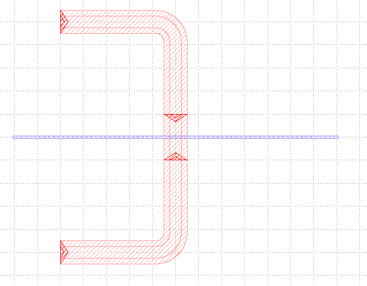

# Using symmetry in a file

Circuits and components can present symmetry axis. For example, if you draw an ATS, you need twice the same
filters, one for each input line. HFSSDrawpy provides a way to easily draw with symmetry, with little code.

## Preamble

In all this document we consider you already know HFSSDrawpy. All examples start with the following boilerplate code:
```python
from HFSSdrawpy import Modeler, Body

pm = Modeler("gds")
body = Body(pm, "chip")

dx = 1e1
dy = 1e-2

track = pm.set_variable("100mm")
gap = pm.set_variable("50mm")
fillet = track + 1.5 * gap

# [all of your code]

# at the end
pm.generate_gds(r".", "tutorial_symmetry")
```

## Using a simple symmetry

Symmetries are realized against an axis. Central symmetry is not supported. 
You have to give this axis by defined its normal vector angle and magnitude
with respect to the local frame (if you used `with body(...)`).



Let's draw a simple triangle :
```python
body.polyline([[0, track], [track, 2 * track], [3 * track, 2 * track]], closed=True)
```

To do its symmetric:
```python
# step 1 : define the symmetry axis, here pi/2
mirror = body.mirror(np.pi / 2, 0)

# step 2: say you want to draw symmetries with respect to the axis
with mirror:
    # step 3: draw what you want
    body.polyline([[0, track], [track, 2 * track], [3 * track, 2 * track]], closed=True)

# step 4: you're done
```

You can run your script and see the output : 


> The blue line was added to materialize the symmetry axis but is not present in the 
> code above


## Dealing with ports

Let's draw a more complex circuit, with ports and cables
```python
# step 1 : define the symmetry axis, here pi/2
mirror = body.mirror(np.pi / 2, 0)

# step 2: say you want to draw symmetries with respect to the axis
with mirror:
    # step 3: draw what you want
    with body([-10 * track, 10 * track], [1, 0]):
        (port_1,) = body.port(name="port_1", widths=[track, track + 2 * gap])
    with body([0, 2 * track], [0, -1]):
        (port_2,) = body.port(name="port_2", widths=[track, track + 2 * gap])
    body.draw_cable(port_1, port_2, fillet=fillet)
```

We get:


Imagine we want to connect port 2 and its symmetric. We need to get a reference to 
both ports. We have defined `port_2` but we need a `port_2_symmetric` somewhere. To
get it, use 
```python 
port_2_symmetric = mirror.get_symmetric_of(port_2)
```

> You can only select symetrics of ports

All in all:
```python
body.polyline([[-dx, -dy], [-dx, dy], [dx, dy], [dx, -dy]], layer=3)
mirror = body.mirror(np.pi / 2, 0)
with mirror:
    with body([-10 * track, 10 * track], [1, 0]):
        (port_1,) = body.port(name="port_1", widths=[track, track + 2 * gap])
    with body([0, 2 * track], [0, -1]):
        (port_2,) = body.port(name="port_2", widths=[track, track + 2 * gap])
    body.draw_cable(port_1, port_2, fillet=fillet)

port_2_symmetric = mirror.get_symmetric_of(port_2)
body.draw_cable_auto(port_2, port_2_symmetric.r, fillet=fillet)

path = r"."
pm.generate_gds(path, "test_symmetry")
```
 Gives you a single cable with all ports connected :partying_face:

